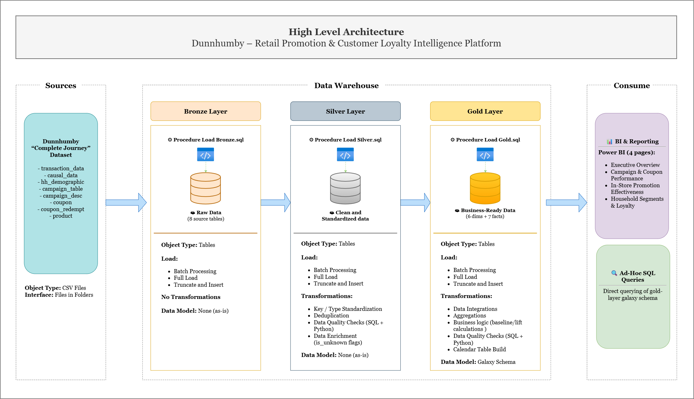

# Retail Promotion & Customer Loyalty Intelligence Platform

> **Are promotions driving real incremental sales, or are they simply subsidizing purchases customers would have made anyway?**

An end-to-end data analytics platform built on the dunnhumby *"The Complete Journey"* retail dataset. It uses a Medallion (Bronze → Silver → Gold) architecture in SQL Server, with data quality testing in SQL as well as Python and a four-page Power BI dashboard, to separate genuine promotional lift from purchases that would have happened regardless.

---

## 🎯 Project Vision

This project explores how retail promotions can be evaluated using **incremental sales rather than promotional sales alone**.

The focus is on identifying which promotions, campaigns, stores, and customer segments generate genuine additional value — and where promotional spending may simply subsidize purchases that would have occurred without the promotion.

## 🎯 Project Goals

- Build an end-to-end **Bronze → Silver → Gold data warehouse** using SQL Server.
- Transform raw retail data into a clean, analytics-ready **galaxy schema**.
- Establish behavioral **baseline sales** to estimate expected spending without promotion.
- Measure **incremental sales lift** and identify **wasted promotional spend**.
- Evaluate promotional effectiveness across **campaigns, coupons, mailers, displays, stores, categories, and household segments**.
- Implement **SQL and Python data quality testing** across the analytical pipeline.
- Deliver an interactive **Power BI dashboard** for business-focused analysis.

---

## 📑 Table of Contents

- [Architecture](#️-architecture)
- [Tech Stack](#️-tech-stack)
- [Repository Structure](#-repository-structure)
- [Key Insights](#-key-insights)
- [Getting Started](#-getting-started--full-execution-order)
- [Documentation](#-documentation)
- [Connect](#-connect)

## 🏗️ Architecture



| Layer | Purpose |
|---|---|
| **Bronze** | Raw data loaded as-is from source CSVs, no transformation |
| **Silver** | Cleaned, standardized, deduplicated data with data quality checks and explicit unknown-record handling |
| **Gold** | Galaxy-schema dimensional model with behavioral baselines, incremental lift, and wasted spend calculated |

See [`docs/data_model.png`](./docs/data_model.png) for the Gold-layer galaxy schema and [`docs/data_integration.png`](./docs/data_integration.png) for the end-to-end data flow.

---

## 🛠️ Tech Stack

- **Database:** Microsoft SQL Server (T-SQL, stored procedures, indexing)
- **Data Quality & Prototyping:** SQL Server, Python (pandas, pytest)
- **Visualization:** Power BI Desktop / DAX
- **Version Control:** Git

---

## 📁 Repository Structure

```text
├── dataset/
├── docs/
├── powerbi/
├── python/
├── scripts/
├── tests/
└── README.md
```
For a detailed explanation of each folder and file, including their purpose and role in the project, see the [Directory Structure](./docs/directory_structure.md) document.

---

## 📊 Key Insights

Full detail, visuals, and interpretation notes: [`powerbi/Readme.md`](./powerbi/Readme.md) · [Dashboard PDF](./powerbi/retail_promotion_intelligence_powerbi_dashboard.pdf)

| Page | Headline Finding |
|---|---|
| **Executive Overview** | ~$1.45M in discount spend generated only ~$230.66K in incremental sales (~6× spend-to-lift, roughly $0.16 incremental sales per $1 spent). 18.97% of spend was wasted. |
| **Campaign & Coupon Performance** | Total incremental lift across campaigns is ~-$24.86M; most campaigns run 85–93% below baseline. Coupon redemption rate: 39.80%. |
| **In-Store Promotion Effectiveness** | Mailer promotions generate positive lift (\~$1.15K/day); display promotions generate negative lift (\~-$167.71/day). |
| **Household Segments & Loyalty** | Across 1,584 targeted households, average incremental lift is $690.28/household. Middle-age segments outperform the average by 59–78%. |

**Overall takeaway:** promotional strategy should move from broad, uniform discounting toward campaign-, mechanism-, and customer-segment-level evaluation. See [`docs/business_logic_and_terminology.md`](./docs/business_logic_and_terminology.md) for the definitions and formulas behind these numbers.

---

## 🚀 Getting Started — Full Execution Order

### Prerequisites

- Microsoft SQL Server + SSMS or Azure Data Studio
- Python 3.x with `pandas` and `pytest` installed
- Power BI Desktop
- Git

### 1. Clone the repository & get the full dataset

```bash
git clone https://github.com/bhawana8954/Retail-Promotion-Intelligence.git
cd Retail-Promotion-Intelligence
```

`transaction_data.csv` and `causal_data.csv` exceed GitHub's file-size limits and aren't committed — 500-row samples are included instead. Follow [`dataset/Readme.md`](./dataset/Readme.md) to download the full official files and place them in the expected path.

### 2. Initialize the database

Run:
```
scripts/0_DDL_initial_database.sql
```
Creates the database and the `bronze`, `silver`, and `gold` schemas.

### 3. Build the Bronze layer

1. Run `scripts/bronze/1_DDL_bronze.sql`
2. Run `scripts/bronze/2_procedure_load_bronze.sql`, then execute the load procedure it creates

See [`scripts/bronze/Readme.md`](./scripts/bronze/Readme.md) for table descriptions and the exact execution command.

### 4. Build the Silver layer

1. Run `scripts/silver/1_DDL_silver.sql`
2. Run `scripts/silver/2_procedure_load_silver.sql`, then execute the load procedure it creates
3. Run `scripts/silver/3_index_silver.sql`
4. Run data quality checks: `tests/procedure_check_data_quality_silver.sql` and `pytest tests/test_data_quality_silver.py`

See [`scripts/silver/Readme.md`](./scripts/silver/Readme.md) for table descriptions and the exact execution command.

### 5. Build the Gold layer

1. Run `scripts/gold/1_DDL_gold.sql`
2. Run `scripts/gold/2_procedure_load_gold.sql`, then execute `EXEC gold.load_gold;`
3. Run `scripts/gold/3_index_gold.sql`
4. Run data quality checks: `tests/procedure_check_data_quality_dimension_gold.sql`, `tests/procedure_check_data_quality_fact_gold.sql`, and `pytest tests/test_data_quality_gold.py`

See [`scripts/gold/Readme.md`](./scripts/gold/Readme.md) for table descriptions and the full execution guide.

### 6. Explore the Power BI dashboard

Open the `.pbix` in Power BI Desktop, connect to the `gold` schema, and refresh. See [`powerbi/Readme.md`](./powerbi/Readme.md) for navigation and page-by-page details.

---

## 📚 Documentation

| Doc | Covers |
|---|---|
| [`docs/business_logic_and_terminology.md`](./docs/business_logic_and_terminology.md) | Core business logic, formulas, DAX/Power BI terminology, glossary |
| [`docs/Directory_Structure.md`](./docs/Directory_Structure.md) | Detailed repository structure and file/folder descriptions |
| [`scripts/bronze/Readme.md`](./scripts/bronze/Readme.md) | Bronze table descriptions + load procedure |
| [`scripts/silver/Readme.md`](./scripts/silver/Readme.md) | Silver table descriptions + load procedure + DQ checks |
| [`scripts/gold/Readme.md`](./scripts/gold/Readme.md) | Gold galaxy-schema, table descriptions, transformations, execution guide |
| [`powerbi/Readme.md`](./powerbi/Readme.md) | Dashboard pages, interactive features, key findings |
| [`dataset/Readme.md`](./dataset/Readme.md) | Dataset source + full-file download instructions |

## 👩‍💻 About the Author

**Bhawana Bhatt** — Mathematics postgraduate and aspiring Data Analyst with an interest in **SQL, data warehousing, Python, and Power BI**.

This project was developed as a portfolio project to demonstrate an end-to-end approach to **data engineering, data quality, business analytics, and visualization**.

### 🔗 Connect

- 💼 [LinkedIn](https://www.linkedin.com/in/bhawanabhatt21)
- 💻 [GitHub](https://github.com/bhawana8954)
- 📊 [Project Repository](https://github.com/bhawana8954/Retail-Promotion-Intelligence)
